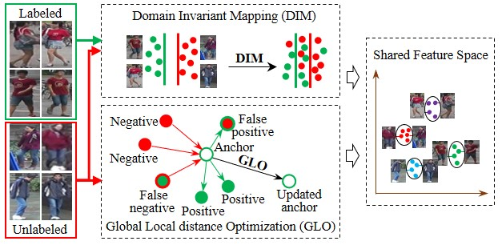

# 基于组合优化的数据域迁移场景下行人再识别
Domain Adaptive Person Re-Identification via Coupling Optimization


# 代码负责人
刘晓滨
# 项目简介
## 1.功能
实现跨数据域的模型训练和测试。 (Codes use Market-1501 as source dataset and DukeMTMC-reID as target dataset.)
## 2.性能
Market->Duke: Rank1 0.755, mAP 0.575
## 3.使用数据集

   - Market-1501 [[BaiduYun]](http://pan.baidu.com/s/1ntIi2Op) [[GoogleDriver]](https://drive.google.com/file/d/0B8-rUzbwVRk0c054eEozWG9COHM/view?usp=sharing) CamStyle (generated by CycleGAN) [[GoogleDriver]](https://drive.google.com/open?id=1klY3nBS2sD4pxcyUbSlhtfTk9ButMNW1) [[BaiduYun]](https://pan.baidu.com/s/1NHv1UfI9bKo1XrDx8g70ow) (password: 6bu4)
   
   - DukeMTMC-reID [[BaiduYun]](https://pan.baidu.com/s/1jS0XM7Var5nQGcbf9xUztw) (password: bhbh) [[GoogleDriver]](https://drive.google.com/open?id=1jjE85dRCMOgRtvJ5RQV9-Afs-2_5dY3O) CamStyle (generated by CycleGAN) [[GoogleDriver]](https://drive.google.com/open?id=1tNc-7C3mpSFa_xOti2PmUVXTEiqmJlUI) [[BaiduYun]](https://pan.baidu.com/s/1NHv1UfI9bKo1XrDx8g70ow) (password: 6bu4)
# 运行环境与依赖
|类别|名称|版本|
|-----|-----|-----|
|os|ubuntu|16.04|
|深度学习框架|pytorch|>=1.1.0|
||opencv|3.4.13|

# 输入与输出
|名称|说明|
|-----|-----|
|输入|RGB图像。大小为256X128（高x宽）|
|输出|2048维浮点特征|

### 修改路径:
#### Market-1501 (Source):
Change the path of Market-1501 to where your dataset are at Line 81 in train.py.


#### Duke (Target):
Change the path of DukeMTMC-reID to where your dataset are at Line 20 in reid/compute_memory_bank.py, Line 103 and Line 108 in reid/compute_map.py, Line 106, 107 and 108 in reid/DukeDataProvider.py.

# 运行方式
terminal 下运行 ``` python train.py ``` 


# Contact me

If you have any question, please feel free to contact me: [Xiaobin Liu](http://liu-xb.github.io)
 
